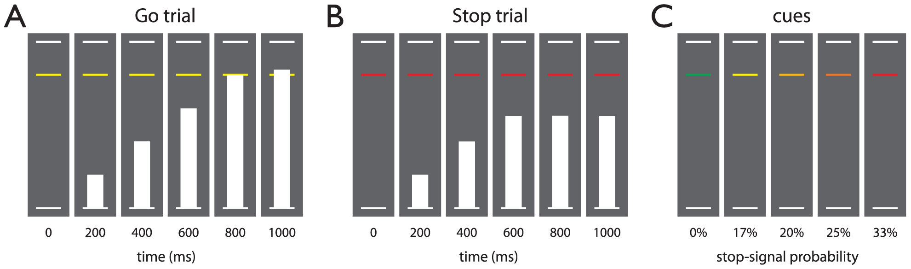

# Stop-Signal Anticipation Task (SSAT)



## 1. Overview

This repository contains the stimulus presentation code (Presentation, [Neurobehavioral Systems, Inc](http://www.neurobs.com/)) for the __stop-signal anticipation task (SSAT)__, a stop-signal paradigm designed to measure __proactive and reactive control__. This task was used in the following experiments, among others:

- Zandbelt, B. B., & Vink, M. (2010). On the Role of the Striatum in Response Inhibition. PLoS ONE, 5(11), e13848.
https://doi.org/10.1371/journal.pone.0013848
- Zandbelt, B. B., van Buuren, M., Kahn, R. S., & Vink, M. (2011). Reduced Proactive Inhibition in Schizophrenia Is Related to Corticostriatal Dysfunction and Poor Working Memory. Biological Psychiatry, 70(12), 1151–1158. https://doi.org/10.1016/j.biopsych.2011.07.028
- Zandbelt, B. B., Bloemendaal, M., Hoogendam, J. M., Kahn, R. S., & Vink, M. (2013). Transcranial magnetic stimulation and functional MRI reveal cortical and subcortical interactions during stop-signal response inhibition. Journal of Cognitive Neuroscience, 25(2), 157–174.
https://doi.org/https://dx.doi.org/10.1162/jocn_a_00309

## 2. Getting started

### Requirements

Running the SSAT requires the following software:
- [Presentation](http://www.neurobs.com/)

### Installation

You can either download the code as a ZIP file or you can clone the SSAT code:

To download the code:
1. Go to the [SSAT repository on GitHub](https://github.com/bramzandbelt/SSAT).
2. Select 'Download ZIP' from the green 'Clone or download' button.
3. Unpack the the ZIP file.

To clone the code, run the following command on the command line (requires Git to be installed):

```
git clone https://github.com/bramzandbelt/SSAT.git
```

### Usage

1. Launch the SSAT [Presentation](http://www.neurobs.com/) experiment, by double-clicking the `SSAT.exp` file, which is located in the main directory containing the SSAT code.

2. In Presentations, configure the Logfile Directory (under Scenarios tab), the Active Buttons (under Settings tab > Response), and the MRI trigger (if you run the task in the scanner environment) or use the default settings.

3. Run the task (under Main tab > Run > Run Scenario).

4. Select the task environment by typing the corresponding number, then press Enter to confirm.

5. Enter the participant's pseudonym, then press Enter to confirm.

5. From the main menu, select the experiment stage by typing the corresponding number, then press Enter to confirm:
  - `1. Practice 1: Response timing`

    The goal of this practice stage is to familiarize the particpant with the main response task: halting the bar at the target response line.
    This stage consists of one run of no-signal (go) 50 trials (duration: 1m40s)  presented in a 0% stop-signal probability context (green cue).
  - `2. Practice 2: Reactive control`
    At this stage, stop-signals are introduced. The goal of this practice stage is to familiarize the particpant with the secondary task: reactive stopping the ongoing response when the bar stops moving automatically before the target response line.
    This stage consists of one run of 50 trials (duration: 1m40s)  presented in a 20% stop-signal probability context (amber cue); 40 trials are no-signal (go) trials, 10 trials are stop trials.
  - `3. Practice 3: Proactive and reactive control`
      At this stage, cues signaling stop-signal probability are introduced.
      The goal of this practice stage is to familiarize the particpant with reactive stopping:
    This stage consists of one run of 474 trials, presented in five different stop-signal probability contexts

      498 trials includes 2 rest blocks of 24 s

  - `4. Experiment`
    The setup of the experiment is similar to that of Practice 3, but the order of trials differs.
  - `5. Quit`

6. The chosen stage will be run

7. After having completed the stage, the program returns to the main menu.

8. Log files are stored separately for each stage of the task in the Logfile Directory, defined under Scenarios tab.

### Log files

The log files created by the SSAT code contain of 7 columns that are coded as follows:

|column name |description|
|------------|-----------|
|trial_number|trial index|
|trial_time  |trial onset time (in ms from moment when "Run Scenario" button is pressed)|
|cue_type    |cue type: <br> 0 = green, <br> 1 = yellow, <br> 2 = amber, <br> 3 = orange, <br> 4 = red|
|stim_type   |stimulus type presented (signal_type would have been a better label): <br> 0 = no-signal (i.e. no-signal/go trial), <br> 1 =  stop-signal (i.e. stop trial) |
|acc         |accuracy: <br> 0 = correct, <br> 1 = incorrect|
|respOnset   |response onset (in ms from trial onset, i.e. when bar starts rising)|
|SSD         |stop-signal delay (in ms from the target response time of 800 ms; e.g. 300 means that the stop-signal occurs at 800 - 300 = 500 ms from trial onset)|

### Trial sequence files

The trial sequence files (`seq_file_*.txt`) determine which cues and stimuli are presented and in which order.
- Each row is a trial; the total number of rows is the total number of trials presented,
- The first integer in a row codes for the cue type on that trial
  - 0 means that a green cue is presented (signaling 0% stop-signal probability)
  - 1 means that a yellow cue is presented (signaling 17% stop-signal probability)
  - 2 means that a amber cue is presented (signaling 20% stop-signal probability)
  - 3 means that a orange cue is presented (signaling 25% stop-signal probability)
  - 4 means that a red cue is presented (signaling 33% stop-signal probability)
  - 5 means that a rest trial is presented
- The second integer in a row codes for the stimulus type on that trial
  - 0 means that no signal will be presented (i.e. no-signal/go trial)
  - 1 means that a stop-signal will be presented (i.e. stop trial)

The sequence files can be easily adjusted. The program cannot generate trial sequences; you have to do that yourself. If you are changing the sequence files and intend to use color cues for signaling stop-signal probability, make sure that the number of stop-signals in a given context matched the intended stop-signal probability.

## 3. Procedure

In the studies referred to above, participants completed all practice stages before participating in the experiment, usually on the same day. Practice stages were repeated in case the participant misunderstood or did not comply with the task instructions.

To instruct the participants, we used both verbal instructions and illustrations/animations (see the file `SSAT_Instruction_Animations.pdf` in the directory `illustrations`):

### Practice 1: Response timing

- Read the following instruction:
> "You are going to perform a task on this computer. In this task, you will make responses to stimuli presented on the computer screen by pressing a button with your right thumb (or index) finger. Sometimes, a stop-signal is presented and if this occurs, you should try to stop your response."

- Show the participant page 1 of `SSAT_Instruction_Animations.pdf` and read the following instruction:
> "On each trial you will see three horizontal lines. The lower and upper lines are white, the middle line has usually a different color."

- On page 1 of `SSAT_Instruction_Animations.pdf`, click on the figure to start the animation, while you read the following instruction:
> "On each trial, a bar appears, rising from the lower line to the upper line in one second."

- On page 2 of `SSAT_Instruction_Animations.pdf`, click on the figure to start the animation, while you read the folowing instruction:
> "Your task is to halt the bar as close to the middle line as possible by pressing the response button."

- Read the following instruction:
> "You will now practice this task for about 2 minutes. Try to halt the bar as close to the middle line as possible by pressing the response button."

- Let the participant perform Practice 1: Response time

### Practice 2: Reactive control

- Show the participant page 3 of `SSAT_Instruction_Animations.pdf` and read the following instruction:
> "The task will now be extended. Sometimes, the bar stops automatically before it reaches the middle line. This is a stop-signal."

- On page 3 of `SSAT_Instruction_Animations.pdf`, click on the figure to start the animation, while you read the following instruction:
> "Here you see an example. If the bar stops automatically before it reaches the middle line, you should try to stop your response. That is, you should not press the button."

- On page 4 of `SSAT_Instruction_Animations.pdf`, click on the left figure to start the animation, while you read the following instruction:
> "If you do press a button when a stop-signal was presented you will see a red cross appearing just above the upper line. This means that you made an error."

- On page 4 of `SSAT_Instruction_Animations.pdf`, click on the right figure to start the animation, while you read the following instruction:
> "You will also see a red cross when the bar reaches the upper line. This means that you have not pressed the button when you should have pressed it. This is also an error."

- Read the following instruction:
> "You will now practice this task for about 2 minutes. Try to halt the bar as close to the middle line as possible by pressing the response button. But try to stop your response when the bar stops moving automatically."

### Practice 3: Proactive and reactive control

- Show the participant page 5 of `SSAT_Instruction_Animations.pdf` and read the following instruction:
> "The task will now be extended further. You may have seen that the color of the middle line has changed from green to yellow from the first to the second practice block. The color of the middle line indicates how likely it is that the bar will stop automatically before reaching the middle line:
  - If the middle line is _green_, then the bar will _never_ stop automatically.
  - If the middle line is _yellow_, then the bar will _very occasionally_ stop automatically.
  - If the middle line is _amber_, then the bar will _sometimes_ stop automatically.
  - If the middle line is _orange_, then the bar will _frequently_ stop automatically.
  - If the middle line is _red_, then the bar will _quite often_ stop automatically.
It is important that you pay close attention to the color of the middle line."

- Read the following instruction:
> "You will now practice this task for about 17 minutes, which is subdivided into three blocks of 5 to 6 minutes. After each block, there is a short break of about half a minute. During the break, you will see only the three white lines displayed.
Remember:
  - Try to halt the bar as close to the middle line as possible by pressing the response button.
  - Try to stop your response when the bar stops moving automatically.
  - And, pay close attention to the color of the middle line."

### Experiment

If the practice session has taken place more than one hour before the experiment, the experimenter provides the participant once again with the above verbal instructions before the experimental session starts.

## Citation
If you use the SSAT, you must cite the software and the original publication describing the task:
- Zandbelt, Bram (2017): Slice Display. figshare. 10.6084/m9.figshare.4742866.
- Zandbelt, B. B., & Vink, M. (2010). On the Role of the Striatum in Response Inhibition. PLoS ONE, 5(11), e13848.
https://doi.org/10.1371/journal.pone.0013848

## Colophon

### Version
Version 0.1 - March 2017

### Contact
E-mail: bramzandbelt@gmail.com

### Acknowledgment
Thanks to Thomas Gladwin for assistance with coding the animation of the moving stimulus.
